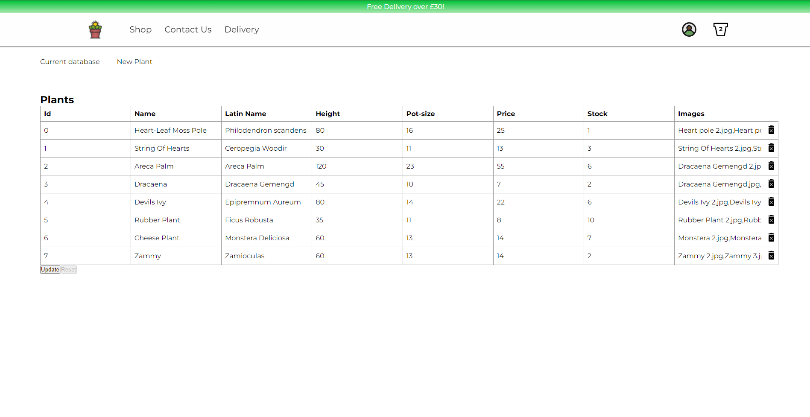
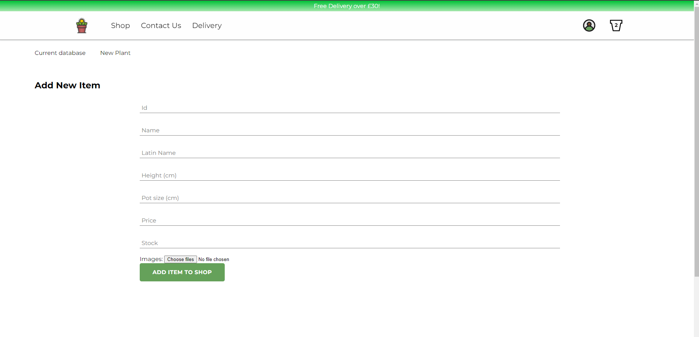

# Nina's Plants

Nina's Plants is an e-commerce store specialising in plants made with React.js, Redux, Node.js, Firebase and more.

Live version hosted at - [Nina's Plants](https://ninas-plants.herokuapp.com/) - please be aware that its a sleeping server so will take few seconds to turn on.

## Contents

1. [ Introduction ](#introduction)
2. [ Technologies ](#technologies)
3. [ Setup ](#setup)
4. [ Features ](#features)
5. [ Status ](#status)

## Introduction

Nina's Plants was originally being built for a small local business however soon after I started the design they decided to move away from this business idea. Although I had no clients, I decided to carry on with the project so I could spend time learning more about how to build e-commerce sites, especially within the React ecosystem. This site is not totally finished since I had to prioritize other projects.

My goals were to:

- Create an aesthetic, intuitive UI
- Cater to all users with a robust UX
- Optimise code and assets in order for fast loading times
- Implement user accounts and learn more about authentication
- Deliver a complete and finished product
- Learn more about React and it's ecosystem
- Learn and implement good practises

## Technologies

Languages, libraries and tools I used:

- Javascript
- React.js - 16.14.0
- Redux - 4.0.5
- Node.js - 9.11.1
- Express.js - 4.16.4
- Styled-components - 5.2.0
- React-spring - 8.0.27
- Stripe - 6.28.0
- Firebase - Firestore, user authentication and storage
- Reselect - 4.0.0
- Nodemailer - 6.4.3
- Handlebars.js - 4.0.0
- Other small libraries/dependencies

## Setup

To run this project locally, install and using npm:

```
$ cd /plant-store
$ npm install
$ npm run dev
```

This will concurrently start the server and the client side code.

## Features

- Loader and error boundary

  When routing a page it will go through an error boundary which will catch any routing errors and direct the user to a custom 404 page which encourages the user to navigate back to main site.

  The loader wheel appears when retrieving the files/assets for a page since I have lazy loaded all pages in order to aid performance.

- Homepage

  Bright, interactive and responsive homepage with information about the business. Used parallax effect and animations for a dynamic and interesting scrolling experience. It also features a "Contact Us" section which uses nodemailer to send an email to the designated address, once sent, it notifies the user.

- Shop-page

  A responsive and clean 3/2 column layout animates in once loaded. Shop items offer option to instantly add item to basket to aid the UX, shop items take advantage of using cursor: pointer and image zoom to imply that it will take you to the item page. Once item is added to cart, there is a notification which gives the option for the user to go straight to the cart to improve UX.

- Item-page

  Has three sections. The images which uses a library `react-awesome-slider` to create an enjoyable viewing experience with tried and tested code. The details section which dynamically adds item data in a spacious manner with emphasis on adding item to cart. The 'You might also like' section which shows other related products using the same library.

- Sign-in

  Simple sign-in form which gives the user an option to go through the site sign in or use the google sign in. This uses firebase authentication process to securely process signing in. Styled the input fields to display what is required even when user has selected it to improve UX.

- Sign-up

  Simple sign-up form which asks uses firebase auth service alongside with firestore service to add user to database is successful in signing up. Styled the input fields to display what is required even when user has selected it to improve UX.

- Cart-slider

  The cart slider smoothly appears out from the side with items animating in for a smooth UI. User is able to adjust cart and item quantity from slider. Any adjustments are made to the state within Redux so that all other components can read from that single source of truth.

- Header

  I wanted the header to disappear when scrolling down yet appear when user scrolls up to improve the UX/UI so I used a lightweight component called `react-headroom`. The user icon gets filled when a user is logged in and is blank when not. I replaced the cart icon with a pot since it seemed for fitting. The cart updates with every item in the cart so user can be aware.

- Footer

  I used a darker background colour to make sure its not too intrusive. The original client used Instagram a lot so I decided to link it in the footer.

- Delivery page

  A simple page giving information of delivery options and restrictions.

- Admin page

  A page for the admin to adjust product information, adjust stock and add or remove products. I use the firebase auth service to make sure that only the admin can enter through a designated email.

  On page load it saves a copy of the database information so there is an option for the admin to revert any changes made before updating the stock. Once the admin is happy with changes they can click the "Update" button which will push all changes to the firebase firestore database.

  

  Adding the new item asks the admin to input necessary data for a new item including images which would get uploaded to firebase storage along with the rest of data which would go to the firebase firestore database.

  

## Status

This project can be found at [Nina's Plants](https://ninas-plants.herokuapp.com/) - please be aware that its a sleeping server so will take few seconds to turn on.

This website is almost finished however since it is simply a portfolio project other projects and jobs usually take priority. There are some minor bugs and issues which I would like to sort out soon for my personal satisfaction.
